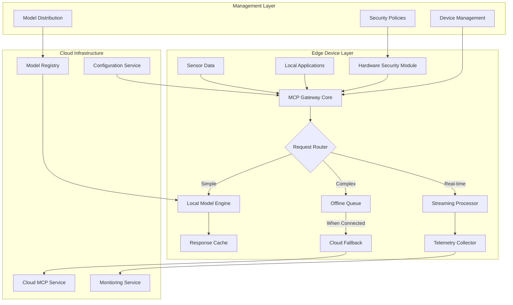
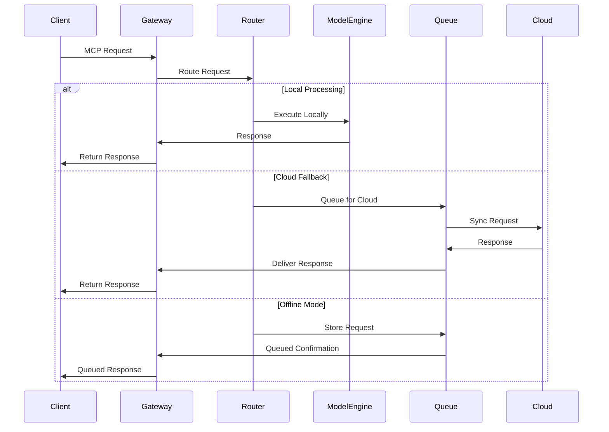
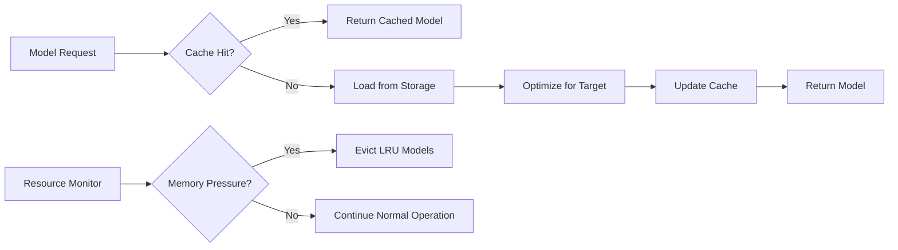
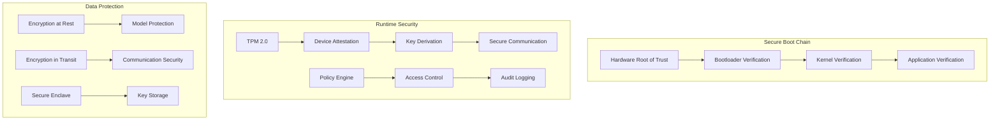

# MCP WASM Edge Gateway - Architecture Design

## 1. System Overview

The MCP WASM Edge Gateway is a distributed edge computing system that brings AI capabilities to resource-constrained devices through an ultra-lightweight WASM-compiled Rust implementation.



## 2. Core Components

### 2.1 Gateway Core (`gateway/`)

**Purpose**: Central orchestration and request handling
**Technology**: Rust with tokio async runtime
**Interfaces**: REST API, gRPC, WebSocket

```rust
pub struct Gateway {
    config: Arc<Config>,
    router: Arc<dyn RequestRouter>,
    model_engine: Arc<ModelEngine>,
    queue: Arc<OfflineQueue>,
    security: Arc<SecurityManager>,
    telemetry: Arc<TelemetryCollector>,
}
```

**Key Responsibilities**:
- Request lifecycle management
- Component orchestration
- Configuration management
- Health monitoring

### 2.2 Request Router (`router/`)

**Purpose**: Intelligent request routing and load balancing
**Technology**: Rule-based engine with ML-based optimization
**Interfaces**: Internal API

```rust
pub trait RequestRouter {
    fn route(&self, request: &MCPRequest) -> RoutingDecision;
    fn update_performance_metrics(&self, metrics: &PerformanceMetrics);
    fn get_routing_strategy(&self) -> RoutingStrategy;
}
```

**Routing Strategies**:
- **Complexity-based**: Route by request complexity analysis
- **Resource-aware**: Consider current device resource usage
- **Performance-optimized**: Historical performance-based decisions
- **Hybrid**: Combine multiple strategies with weights

### 2.3 Model Engine (`models/`)

**Purpose**: Local model execution and optimization
**Technology**: GGML, ONNX Runtime, TensorFlow Lite integration
**Interfaces**: Unified model API

```rust
pub struct ModelEngine {
    models: HashMap<String, Box<dyn Model>>,
    cache: LRUCache<String, ModelOutput>,
    resource_monitor: ResourceMonitor,
    optimizer: ModelOptimizer,
}
```

**Supported Formats**:
- GGML quantized models (4-bit, 8-bit)
- ONNX optimized for edge
- TensorFlow Lite models
- Custom WASM-compiled models

### 2.4 Offline Queue (`queue/`)

**Purpose**: Persistent request queuing and synchronization
**Technology**: Embedded database (SQLite/LMDB) with compression
**Interfaces**: Queue API, Sync API

```rust
pub struct OfflineQueue {
    storage: Box<dyn QueueStorage>,
    compression: CompressionEngine,
    sync_scheduler: SyncScheduler,
    conflict_resolver: ConflictResolver,
}
```

**Features**:
- Priority-based queuing
- Automatic retry with exponential backoff
- Conflict resolution for concurrent updates
- Compression for storage efficiency

### 2.5 Security Manager (`security/`)

**Purpose**: Hardware security integration and cryptographic operations
**Technology**: TPM 2.0, HSM integration, Rust crypto libraries
**Interfaces**: Security API, Attestation API

```rust
pub struct SecurityManager {
    hsm: Option<Box<dyn HSMProvider>>,
    key_manager: KeyManager,
    attestation: AttestationService,
    policy_engine: PolicyEngine,
}
```

**Security Features**:
- Device identity and attestation
- Key generation and rotation
- Secure communication
- Policy enforcement

### 2.6 Telemetry Collector (`telemetry/`)

**Purpose**: Metrics collection, aggregation, and export
**Technology**: Prometheus metrics, OpenTelemetry, custom compression
**Interfaces**: Metrics API, Export API

```rust
pub struct TelemetryCollector {
    metrics_registry: MetricsRegistry,
    exporter: Box<dyn MetricsExporter>,
    compression: CompressionEngine,
    buffer: CircularBuffer<MetricPoint>,
}
```

## 3. Data Flow Architecture

### 3.1 Request Processing Flow



### 3.2 Model Loading and Caching



### 3.3 Security Architecture



## 4. Platform-Specific Adaptations

### 4.1 Raspberry Pi Implementation

```rust
#[cfg(target_arch = "aarch64")]
impl PlatformAdapter for RaspberryPiAdapter {
    fn optimize_for_platform(&self, config: &mut Config) {
        config.max_memory_mb = 1024;
        config.enable_gpu_acceleration = true;
        config.thermal_management = ThermalProfile::Moderate;
    }
    
    fn get_hardware_capabilities(&self) -> HardwareCapabilities {
        HardwareCapabilities {
            has_tpm: true,
            has_gpu: true,
            max_cpu_cores: 4,
            memory_bandwidth_gbps: 4.0,
        }
    }
}
```

### 4.2 ESP32 Implementation

```rust
#[cfg(target_arch = "xtensa")]
impl PlatformAdapter for ESP32Adapter {
    fn optimize_for_platform(&self, config: &mut Config) {
        config.max_memory_mb = 64;
        config.enable_psram = true;
        config.power_profile = PowerProfile::UltraLowPower;
    }
    
    fn get_hardware_capabilities(&self) -> HardwareCapabilities {
        HardwareCapabilities {
            has_tpm: false,
            has_gpu: false,
            max_cpu_cores: 2,
            memory_bandwidth_gbps: 0.1,
        }
    }
}
```

### 4.3 WASM Implementation

```rust
#[cfg(target_arch = "wasm32")]
impl PlatformAdapter for WASMAdapter {
    fn optimize_for_platform(&self, config: &mut Config) {
        config.max_memory_mb = 256;
        config.enable_simd = true;
        config.threading_model = ThreadingModel::SingleThreaded;
    }
    
    fn get_runtime_capabilities(&self) -> RuntimeCapabilities {
        RuntimeCapabilities {
            has_wasi: true,
            has_web_apis: true,
            sandboxed: true,
            persistent_storage: false,
        }
    }
}
```

## 5. Performance Optimizations

### 5.1 Memory Management

```rust
pub struct MemoryManager {
    // Pool-based allocation for predictable performance
    request_pool: ObjectPool<MCPRequest>,
    response_pool: ObjectPool<MCPResponse>,
    
    // LRU cache with size limits
    model_cache: LRUCache<ModelId, Arc<Model>>,
    
    // Memory pressure monitoring
    memory_monitor: MemoryMonitor,
}
```

### 5.2 SIMD Optimizations

```rust
#[cfg(target_feature = "simd128")]
fn optimize_tensor_operations(input: &[f32]) -> Vec<f32> {
    use std::simd::f32x4;
    
    input
        .chunks_exact(4)
        .map(|chunk| {
            let simd_chunk = f32x4::from_slice(chunk);
            // SIMD operations for matrix multiplication
            simd_chunk * WEIGHT_MATRIX_SIMD
        })
        .collect()
}
```

### 5.3 Async I/O and Concurrency

```rust
pub struct AsyncRuntime {
    // Single-threaded async runtime for WASM compatibility
    #[cfg(target_arch = "wasm32")]
    runtime: wasm_bindgen_futures::spawn_local,
    
    // Multi-threaded runtime for native platforms
    #[cfg(not(target_arch = "wasm32"))]
    runtime: tokio::runtime::Runtime,
}
```

## 6. Scalability Considerations

### 6.1 Horizontal Scaling

- **Device Clustering**: Peer-to-peer device discovery and load sharing
- **Request Distribution**: Intelligent request routing across device clusters
- **Model Sharing**: Shared model cache across trusted devices
- **Telemetry Aggregation**: Hierarchical metrics collection

### 6.2 Vertical Scaling

- **Dynamic Resource Allocation**: Adaptive memory and CPU usage
- **Model Optimization**: Runtime model quantization and pruning
- **Cache Management**: Intelligent cache warming and eviction
- **Power Management**: Dynamic frequency scaling

## 7. Error Handling and Resilience

### 7.1 Fault Tolerance

```rust
#[derive(Debug)]
pub enum GatewayError {
    ModelLoadError(ModelError),
    NetworkError(NetworkError),
    SecurityError(SecurityError),
    ResourceExhausted(ResourceError),
}

impl Gateway {
    async fn handle_request_with_retry(&self, request: MCPRequest) -> Result<MCPResponse> {
        let mut attempts = 0;
        let max_attempts = self.config.max_retry_attempts;
        
        while attempts < max_attempts {
            match self.process_request(&request).await {
                Ok(response) => return Ok(response),
                Err(e) if e.is_retryable() => {
                    attempts += 1;
                    tokio::time::sleep(self.backoff_duration(attempts)).await;
                }
                Err(e) => return Err(e),
            }
        }
        
        Err(GatewayError::MaxRetriesExceeded)
    }
}
```

### 7.2 Circuit Breaker Pattern

```rust
pub struct CircuitBreaker {
    state: CircuitState,
    failure_count: AtomicU32,
    success_count: AtomicU32,
    last_failure_time: AtomicU64,
    config: CircuitBreakerConfig,
}

impl CircuitBreaker {
    pub async fn call<F, T>(&self, operation: F) -> Result<T>
    where
        F: Future<Output = Result<T>>,
    {
        match self.state {
            CircuitState::Closed => self.try_operation(operation).await,
            CircuitState::Open => Err(GatewayError::CircuitBreakerOpen),
            CircuitState::HalfOpen => self.test_operation(operation).await,
        }
    }
}
```

## 8. Monitoring and Observability

### 8.1 Metrics Collection

```rust
pub struct MetricsCollector {
    // Performance metrics
    request_duration: Histogram,
    request_count: Counter,
    active_connections: Gauge,
    
    // Resource metrics
    memory_usage: Gauge,
    cpu_usage: Gauge,
    model_cache_size: Gauge,
    
    // Business metrics
    local_requests: Counter,
    cloud_fallback_requests: Counter,
    offline_queued_requests: Counter,
}
```

### 8.2 Distributed Tracing

```rust
use opentelemetry::{trace::Tracer, Context};

impl Gateway {
    #[tracing::instrument(skip(self))]
    async fn process_request(&self, request: &MCPRequest) -> Result<MCPResponse> {
        let span = self.tracer.start("gateway.process_request");
        let _guard = span.enter();
        
        // Request processing with automatic span management
        self.router.route(request).await
    }
}
```

## 9. Security Architecture Deep Dive

### 9.1 Zero Trust Model

```rust
pub struct ZeroTrustManager {
    identity_verifier: IdentityVerifier,
    policy_engine: PolicyEngine,
    risk_assessor: RiskAssessor,
    audit_logger: AuditLogger,
}

impl ZeroTrustManager {
    pub async fn authorize_request(&self, request: &MCPRequest) -> AuthorizationResult {
        // Verify device identity
        let identity = self.identity_verifier.verify(&request.device_id).await?;
        
        // Assess request risk
        let risk_score = self.risk_assessor.assess_request(request, &identity).await?;
        
        // Apply policies
        let decision = self.policy_engine.evaluate(&identity, request, risk_score).await?;
        
        // Log for audit
        self.audit_logger.log_authorization(&identity, request, &decision).await?;
        
        Ok(decision)
    }
}
```

### 9.2 Secure Model Loading

```rust
pub struct SecureModelLoader {
    signature_verifier: SignatureVerifier,
    integrity_checker: IntegrityChecker,
    sandbox: ModelSandbox,
}

impl SecureModelLoader {
    pub async fn load_model(&self, model_path: &Path) -> Result<Arc<dyn Model>> {
        // Verify model signature
        self.signature_verifier.verify_file(model_path).await?;
        
        // Check integrity
        self.integrity_checker.verify_checksum(model_path).await?;
        
        // Load in sandbox
        let model = self.sandbox.load_model(model_path).await?;
        
        Ok(Arc::new(model))
    }
}
```

This architecture provides a robust, scalable, and secure foundation for edge AI deployment while maintaining the flexibility to adapt to various hardware platforms and use cases.