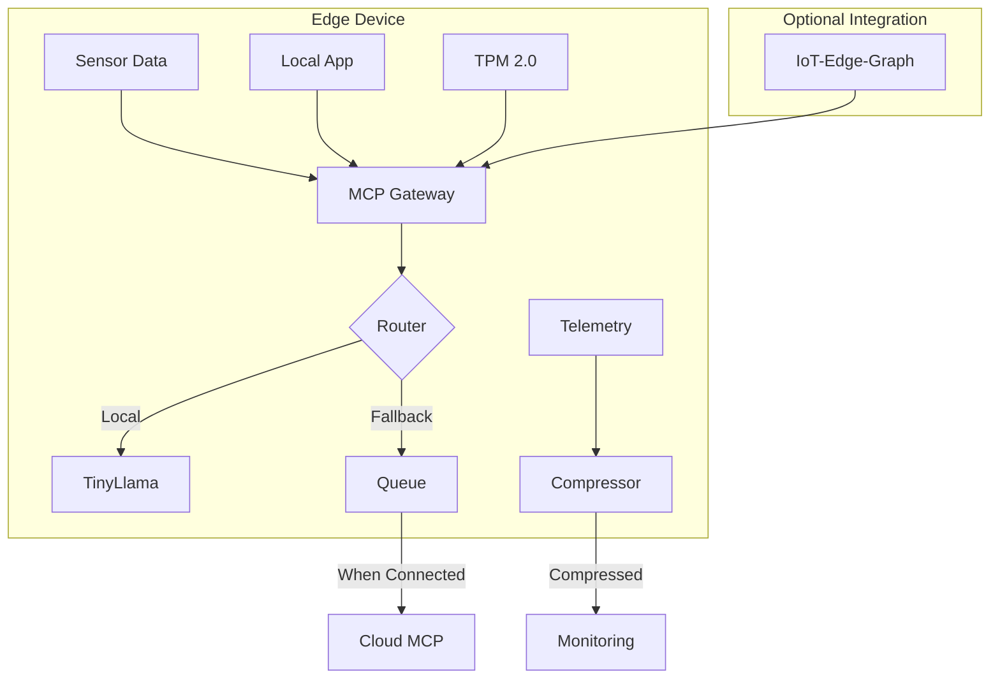

# mcp-wasm-edge-gateway

[](https://github.com/your-org/mcp-wasm-edge-gateway/actions)
[](https://crates.io/crates/mcp-wasm-edge-gateway)
[](LICENSE)
[](https://bundlephobia.com/package/mcp-wasm-edge-gateway)

Ultra-lightweight (<3MB) Model Context Protocol gateway for edge devices. Written in Rust, compiled to WASM with SIMD optimizations. Enable secure AI interactions on IoT devices, mobile apps, and resource-constrained environments.

## 🎯 Key Features

- **Tiny Footprint**: <3MB WASM binary with SIMD optimizations
- **Edge-Native MCP**: Full Model Context Protocol implementation for edge
- **Hybrid Execution**: Local model with automatic cloud fallback
- **Offline-First**: Queue and sync when connected
- **Hardware Security**: TPM 2.0 and secure enclave support
- **Power Efficient**: Optimized for battery-powered devices
- **Real-time Telemetry**: Compressed metrics for bandwidth savings

## 📋 Table of Contents

- [Installation](#installation)
- [Quick Start](#quick-start)
- [Architecture](#architecture)
- [Configuration](#configuration)
- [Edge Deployment](#edge-deployment)
- [Security](#security)
- [Performance](#performance)
- [API Reference](#api-reference)
- [Examples](#examples)
- [Contributing](#contributing)

## 🚀 Installation

### Rust Project

```toml
[dependencies]
mcp-wasm-edge-gateway = "0.1.0"

# Optional features
[features]
tpm = ["mcp-wasm-edge-gateway/tpm"]
simd = ["mcp-wasm-edge-gateway/simd"]
compression = ["mcp-wasm-edge-gateway/compression"]
```

### Pre-built Binaries

```bash
# Raspberry Pi
curl -L https://github.com/your-org/mcp-wasm-edge-gateway/releases/latest/download/mcp-gateway-arm64 -o mcp-gateway
chmod +x mcp-gateway

# NVIDIA Jetson
curl -L https://github.com/your-org/mcp-wasm-edge-gateway/releases/latest/download/mcp-gateway-jetson -o mcp-gateway

# ESP32 (Arduino)
# Use Arduino Library Manager: search "MCP Edge Gateway"
```

### Docker (for testing)

```bash
docker run -p 8080:8080 your-org/mcp-edge-gateway:latest
```

## ⚡ Quick Start

### Basic Rust Implementation

```rust
use mcp_wasm_edge_gateway::{Gateway, Config, ModelRouter};

#[tokio::main]
async fn main() -> Result<(), Box<dyn std::error::Error>> {
    // Configure gateway
    let config = Config::builder()
        .local_model("tinyllama-1.1b-q4")
        .cloud_fallback("https://api.your-org.com/v1/mcp")
        .offline_queue_size(1000)
        .build()?;
    
    // Initialize gateway
    let gateway = Gateway::new(config);
    
    // Start serving
    gateway.serve("0.0.0.0:8080").await?;
    
    Ok(())
}
```

### Arduino/ESP32 Example

```cpp
#include <MCPEdgeGateway.h>

MCPGateway gateway;

void setup() {
    Serial.begin(115200);
    
    // Configure for ESP32
    GatewayConfig config;
    config.localModel = "phi-3-mini-q4";
    config.maxMemoryMB = 100;
    config.enableCompression = true;
    
    gateway.begin(config);
}

void loop() {
    if (gateway.hasRequest()) {
        MCPRequest req = gateway.getRequest();
        MCPResponse res = gateway.process(req);
        gateway.sendResponse(res);
    }
    
    delay(10);
}
```

## 🏗️ Architecture



## ⚙️ Configuration

### Edge Configuration File

Create `mcp-edge.toml`:

```toml
[gateway]
# Core settings
bind_address = "0.0.0.0:8080"
max_connections = 100
request_timeout_ms = 5000

[models]
# Local model configuration
local_model = "phi-3-mini-q4"
model_path = "/opt/models/"
max_memory_mb = 512
max_tokens = 1024

# Fallback configuration
cloud_endpoint = "https://api.your-org.com/v1/mcp"
cloud_api_key = "${MCP_API_KEY}"
fallback_threshold_ms = 2000

[offline]
# Offline-first settings
queue_size = 1000
persistence_path = "/var/lib/mcp/queue"
sync_interval_seconds = 300
compression = "zstd"

[security]
# Hardware security
use_tpm = true
tpm_device = "/dev/tpm0"
attestation_required = true

# Encryption
tls_cert = "/etc/mcp/cert.pem"
tls_key = "/etc/mcp/key.pem"

[telemetry]
# Monitoring
enabled = true
export_interval_seconds = 60
compression = "lz4"
endpoints = ["https://metrics.your-org.com/v1/edge"]

[power]
# Power management
low_power_mode = true
cpu_throttle_percent = 50
gpu_enabled = false
sleep_on_idle_ms = 1000
```

### Programmatic Configuration

```rust
use mcp_wasm_edge_gateway::{Config, PowerProfile, SecurityMode};

let config = Config::builder()
    // Model settings
    .local_model("phi-3-mini-q4")
    .model_memory_limit_mb(256)
    .cloud_fallback_url("https://api.your-org.com/v1/mcp")
    
    // Offline support
    .offline_queue_size(500)
    .sync_strategy(SyncStrategy::Batched { size: 50 })
    
    // Security
    .security_mode(SecurityMode::Hardware)
    .require_attestation(true)
    
    // Power optimization
    .power_profile(PowerProfile::LowPower)
    .idle_timeout_ms(5000)
    
    // Telemetry
    .telemetry_compression("zstd")
    .telemetry_batch_size(100)
    
    .build()?;
```

## 🔧 Edge Deployment

### Raspberry Pi Setup

```bash
# Install dependencies
sudo apt-get update
sudo apt-get install -y libssl-dev

# Download and install
wget https://github.com/your-org/mcp-wasm-edge-gateway/releases/latest/download/install-pi.sh
chmod +x install-pi.sh
sudo ./install-pi.sh

# Configure systemd service
sudo systemctl enable mcp-gateway
sudo systemctl start mcp-gateway
```

### NVIDIA Jetson Deployment

```bash
# Use Jetson-optimized build with GPU support
docker run -d \
  --runtime nvidia \
  --name mcp-gateway \
  -p 8080:8080 \
  -v /dev/tpm0:/dev/tpm0 \
  your-org/mcp-edge-gateway:jetson
```

### ESP32/Arduino Configuration

```cpp
// Platform-specific optimizations
#ifdef ESP32
    gateway.enablePSRAM();
    gateway.setCPUFrequency(160); // MHz
#endif

#ifdef ARDUINO_ARCH_RP2040
    gateway.enableDualCore();
#endif
```

## 🔐 Security

### Hardware Security Module Integration

```rust
use mcp_wasm_edge_gateway::{HSMProvider, AttestationPolicy};

// Configure HSM
let hsm = HSMProvider::new()
    .device("/dev/tpm0")
    .attestation_policy(AttestationPolicy::Strict)
    .key_rotation_hours(24);

gateway.set_hsm(hsm)?;

// Verify attestation
let attestation = gateway.get_attestation()?;
println!("Device attestation: {:?}", attestation);
```

### Secure Communication

```rust
// Enable mutual TLS
let tls_config = TlsConfig::new()
    .cert_path("/etc/mcp/device.crt")
    .key_path("/etc/mcp/device.key")
    .ca_path("/etc/mcp/ca.crt")
    .require_client_cert(true);

gateway.set_tls(tls_config)?;
```

## 📊 Performance

### Benchmarks

| Device | Model | Latency (p99) | Throughput | Power |
|--------|-------|---------------|------------|-------|
| Raspberry Pi 4 | Phi-3 Mini | 120ms | 50 req/s | 2.1W |
| Jetson Nano | TinyLlama | 45ms | 120 req/s | 5W |
| ESP32-S3 | Tokenizer Only | 200ms | 10 req/s | 0.15W |
| iPhone 14 (WASM) | Phi-3 Mini | 80ms | 80 req/s | 1.5W |

### Memory Usage

```rust
// Configure memory limits
gateway.set_memory_limits(MemoryLimits {
    model_cache_mb: 128,
    request_buffer_mb: 16,
    response_buffer_mb: 16,
    telemetry_buffer_mb: 8,
});

// Monitor usage
let stats = gateway.memory_stats();
println!("Model cache: {}MB", stats.model_cache_used_mb);
```

## 📚 API Reference

### Core Gateway API

```rust
pub struct Gateway {
    pub fn new(config: Config) -> Result<Self>;
    pub async fn serve(&self, addr: &str) -> Result<()>;
    pub fn process(&self, request: MCPRequest) -> MCPResponse;
    pub fn queue_for_sync(&self, request: MCPRequest) -> Result<()>;
    pub async fn sync_offline_queue(&self) -> Result<SyncStats>;
}
```

### Model Router

```rust
pub trait ModelRouter {
    fn should_use_local(&self, request: &MCPRequest) -> bool;
    fn select_model(&self, request: &MCPRequest) -> ModelSelection;
    fn fallback_strategy(&self) -> FallbackStrategy;
}
```

### REST API Endpoints

```bash
# Health check
GET /health

# Process MCP request
POST /v1/mcp/completions
{
  "messages": [...],
  "tools": [...],
  "temperature": 0.7
}

# Queue status
GET /v1/queue/status

# Force sync
POST /v1/queue/sync

# Device metrics
GET /metrics
```

## 💡 Examples

### IoT Sensor Integration

```rust
use mcp_wasm_edge_gateway::{Gateway, StreamProcessor};

// Process sensor stream with local AI
let processor = StreamProcessor::new(gateway);

sensor_stream
    .map(|reading| processor.analyze(reading))
    .filter(|result| result.anomaly_score > 0.8)
    .for_each(|anomaly| {
        gateway.alert(anomaly);
    });
```

### Mobile App Integration

```swift
// Swift example for iOS
import MCPEdgeGateway

class AIAssistant {
    let gateway = MCPGateway(
        config: .init(
            localModel: "phi-3-mini",
            maxMemoryMB: 200,
            useCoreML: true
        )
    )
    
    func process(_ prompt: String) async -> String {
        let response = await gateway.complete(prompt)
        return response.text
    }
}
```

## 🤝 Contributing

We welcome contributions! See [CONTRIBUTING.md](CONTRIBUTING.md) for guidelines.

### Development Setup

```bash
# Clone repository
git clone https://github.com/your-org/mcp-wasm-edge-gateway
cd mcp-wasm-edge-gateway

# Install Rust toolchain
rustup target add wasm32-wasi
rustup target add wasm32-unknown-unknown

# Build
cargo build --release --target wasm32-wasi

# Run tests
cargo test

# Build for specific platform
./build.sh --platform raspberry-pi
```

## 📄 License

This project is licensed under the Apache License 2.0 - see the [LICENSE](LICENSE) file for details.

## 🔗 Related Projects

- [Model Context Protocol](https://github.com/your-org/mcp) - Protocol specification
- [IoT-Edge-Graph-Anomaly](https://github.com/your-org/iot-edge-graph-anomaly) - Graph-based IoT analytics
- [TinyLLM-Runtime](https://github.com/your-org/tinyllm-runtime) - Optimized edge inference

## 📞 Support

- 📧 Email: edge-ai@your-org.com
- 💬 Discord: [Join our community](https://discord.gg/your-org)
- 📖 Documentation: [Full docs](https://docs.your-org.com/mcp-edge)
- 🔧 Hardware Guide: [Supported devices](https://docs.your-org.com/mcp-edge/hardware)
