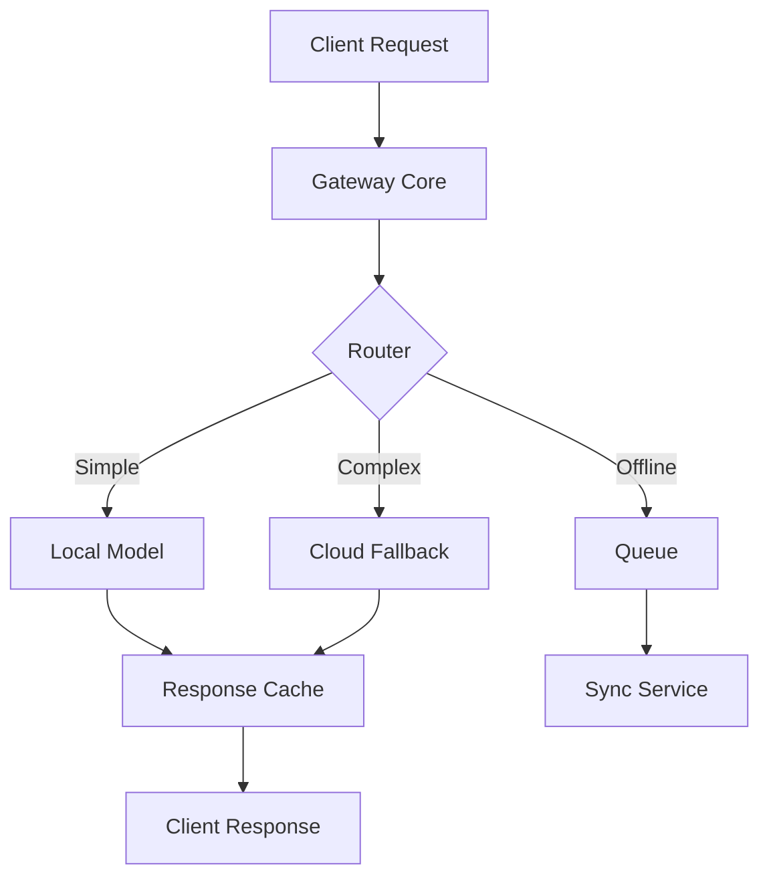

# Development Guide

This guide provides instructions for setting up a development environment and contributing to the MCP WASM Edge Gateway project.

## Quick Start

### Prerequisites

- **Rust** 1.75+ with Cargo
- **Node.js** 18+ and npm
- **Docker** and Docker Compose
- **Git** with LFS support

### Setup Development Environment

1. **Clone the repository**:
   ```bash
   git clone https://github.com/your-org/mcp-wasm-edge-gateway
   cd mcp-wasm-edge-gateway
   ```

2. **Install Rust targets and tools**:
   ```bash
   make setup
   # or manually:
   rustup target add wasm32-unknown-unknown wasm32-wasi aarch64-unknown-linux-gnu
   cargo install wasm-pack cargo-audit cargo-tarpaulin
   ```

3. **Install dependencies**:
   ```bash
   npm install
   cargo fetch
   ```

4. **Start development environment**:
   ```bash
   make dev
   # This starts the full stack with Docker Compose
   ```

5. **Run tests**:
   ```bash
   make test
   ```

## Development Workflow

### Building

```bash
# Build native binary
make build

# Build WASM packages
make wasm

# Build for all platforms
make cross

# Build with specific features
cargo build --features "hardware-security,compression"
```

### Testing

```bash
# Run unit tests
cargo test

# Run integration tests
cargo test --test integration --features integration-tests

# Run WASM tests
wasm-pack test --node

# Run all tests
make test-all

# Generate coverage report
make coverage
```

### Code Quality

```bash
# Format code
make format

# Check formatting
make format-check

# Run lints
make lint

# Security audit
make audit

# Run all quality checks
make ci
```

## Project Structure

```
mcp-wasm-edge-gateway/
├── src/                    # Source code
│   ├── bin/               # Binary targets
│   ├── config.rs          # Configuration
│   ├── gateway.rs         # Main gateway
│   ├── router.rs          # Request routing
│   ├── models.rs          # Model management
│   ├── queue.rs           # Offline queue
│   ├── security.rs        # Security features
│   ├── telemetry.rs       # Metrics and observability
│   └── error.rs           # Error handling
├── tests/                 # Integration tests
├── benches/               # Benchmarks
├── examples/              # Usage examples
├── docs/                  # Documentation
├── scripts/               # Build and utility scripts
├── monitoring/            # Monitoring configuration
├── .devcontainer/         # Development container
├── .github/workflows/     # CI/CD workflows
└── target/                # Build artifacts
```

## Architecture Overview

### Core Components

1. **Gateway Core**: Central orchestration and request handling
2. **Request Router**: Intelligent routing based on complexity and resources
3. **Model Engine**: Local model execution and optimization
4. **Offline Queue**: Persistent request queuing and synchronization
5. **Security Manager**: Hardware security integration
6. **Telemetry Collector**: Metrics collection and export

### Data Flow



## Platform Support

### Target Platforms

- **x86_64-unknown-linux-gnu**: Standard Linux
- **aarch64-unknown-linux-gnu**: ARM64 (Raspberry Pi, Jetson)
- **wasm32-unknown-unknown**: Browser WASM
- **wasm32-wasi**: WASI environments
- **x86_64-pc-windows-gnu**: Windows (cross-compiled)

### Platform-Specific Features

```rust
#[cfg(feature = "raspberry-pi")]
fn pi_specific_optimization() {
    // Raspberry Pi optimizations
}

#[cfg(target_arch = "wasm32")]
fn wasm_specific_feature() {
    // WASM-specific code
}
```

## Configuration

### Development Configuration

Create a local `.env` file:

```bash
cp .env.example .env
# Edit .env with your local settings
```

### Feature Flags

- `native`: Native platform features (tokio, file system)
- `wasm`: WebAssembly-specific features
- `embedded`: Embedded platform features
- `hardware-security`: TPM and HSM support
- `compression`: Data compression support
- `metrics`: Prometheus metrics export

## Testing Strategy

### Unit Tests

Located alongside source code:

```rust
#[cfg(test)]
mod tests {
    use super::*;
    
    #[test]
    fn test_basic_functionality() {
        // Test implementation
    }
}
```

### Integration Tests

Located in `tests/` directory:

```rust
#[tokio::test]
async fn test_full_request_flow() {
    let gateway = setup_test_gateway().await?;
    let response = gateway.process_request(request).await?;
    assert_eq!(response.status, "success");
}
```

### Benchmarks

Performance testing with Criterion:

```rust
fn benchmark_request_processing(c: &mut Criterion) {
    c.bench_function("simple_request", |b| {
        b.iter(|| process_simple_request())
    });
}
```

## Debugging

### Local Debugging

1. **Set log level**:
   ```bash
   export RUST_LOG=mcp_gateway=debug
   ```

2. **Use VS Code debugger**:
   - Set breakpoints in code
   - Press F5 to start debugging
   - Use "Debug Gateway" configuration

3. **Print debugging**:
   ```rust
   tracing::debug!("Processing request: {:?}", request);
   ```

### WASM Debugging

1. **Browser DevTools**:
   ```bash
   wasm-pack build --dev --target web
   # Serve with browser dev server
   ```

2. **Console logging**:
   ```rust
   #[cfg(target_arch = "wasm32")]
   web_sys::console::log_1(&"Debug message".into());
   ```

## Performance Optimization

### Profiling

```bash
# CPU profiling
make profile

# Memory profiling
valgrind --tool=massif target/release/gateway

# Binary size analysis
make size
```

### Optimization Guidelines

1. **Minimize allocations** in hot paths
2. **Use `&str` instead of `String`** when possible
3. **Prefer `Vec::with_capacity()`** for known sizes
4. **Use `Box<str>` for immutable strings**
5. **Consider `Cow<str>` for conditional ownership**

## Cross-Platform Development

### Cross-Compilation

```bash
# Install cross-compilation targets
rustup target add aarch64-unknown-linux-gnu

# Install cross-compilation toolchain
sudo apt-get install gcc-aarch64-linux-gnu

# Build for target
cargo build --target aarch64-unknown-linux-gnu
```

### Platform Testing

```bash
# Test on Raspberry Pi (using QEMU)
./scripts/test-pi.sh

# Test WASM in browser
./scripts/test-wasm.sh

# Test embedded target
./scripts/test-embedded.sh
```

## Contributing Guidelines

### Code Style

- Follow Rust standard conventions
- Use `rustfmt` for formatting
- Address all `clippy` warnings
- Write comprehensive tests
- Document public APIs

### Commit Messages

Use conventional commits:

```
feat: add TPM attestation support
fix: resolve memory leak in queue manager
docs: update API documentation
test: add integration tests for routing
```

### Pull Request Process

1. Create feature branch from `develop`
2. Implement changes with tests
3. Ensure all CI checks pass
4. Submit PR with clear description
5. Address review feedback
6. Squash commits before merge

## Troubleshooting

### Common Issues

**Build fails with missing dependencies**:
```bash
# Update Rust toolchain
rustup update
# Install missing system dependencies
sudo apt-get install build-essential pkg-config libssl-dev
```

**WASM build fails**:
```bash
# Install wasm-pack
cargo install wasm-pack
# Check target is installed
rustup target list --installed | grep wasm32
```

**Tests fail with permission errors**:
```bash
# Ensure proper permissions for test files
chmod +x scripts/test-*.sh
# Run with proper user permissions
sudo usermod -a -G docker $USER
```

### Debug Logs

Enable comprehensive logging:

```bash
export RUST_LOG=mcp_gateway=trace,hyper=debug,tokio=debug
export RUST_BACKTRACE=full
```

## Resources

- [Rust Book](https://doc.rust-lang.org/book/)
- [WASM Book](https://rustwasm.github.io/book/)
- [Tokio Tutorial](https://tokio.rs/tokio/tutorial)
- [Criterion Benchmarking](https://bheisler.github.io/criterion.rs/book/)
- [Project Discord](https://discord.gg/your-server)

## License

Development documentation is licensed under MIT License.